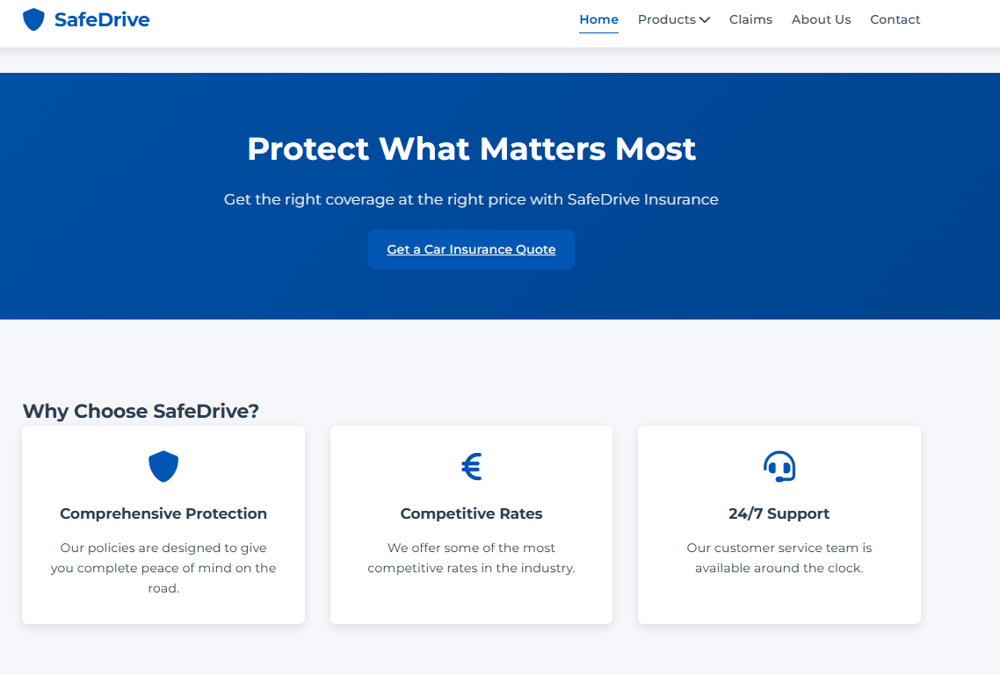
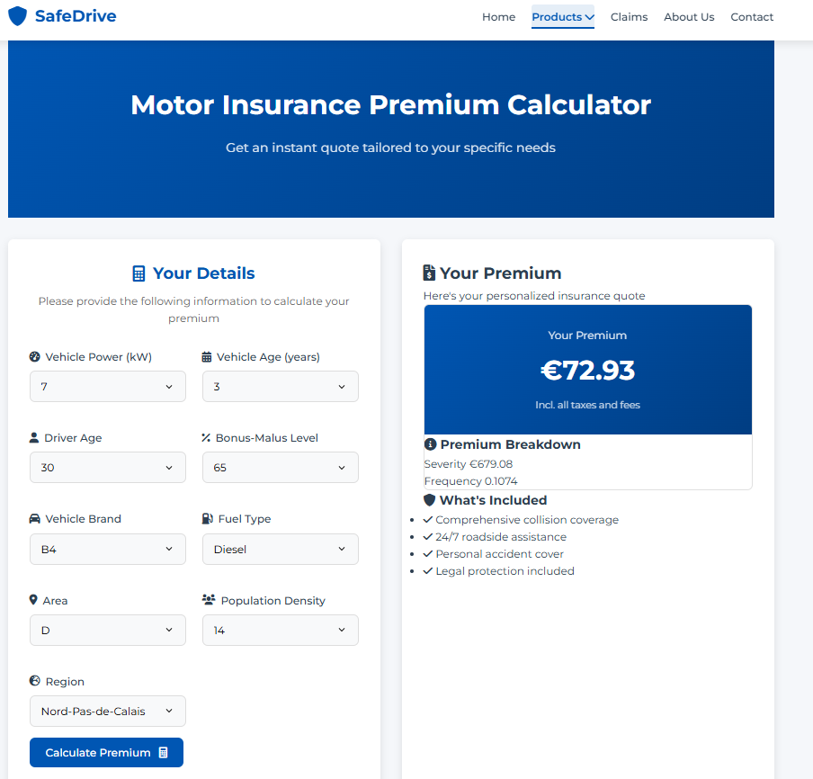

# Car Insurance Quotation Website

---
This website has been built using **HTML/CSS/JS** in order to get have a user-friendly frontend to get a quote from a
Car Insurance Pricing API.

## Homepage

Here is what the homepage looks like :

By clicking on ***Get a Car Insurance Quote*** you should land this the page to be able to get a quote

## Car Insurance Quotation Engine

Here is what the car insurance quotation engine looks like :

By filling the form, you will have the quote for the client that you are. Of course in this case, the information are
simplified as this is a demo project :) 

## Backend API

If you want to have a look at the API in which this website is connected, please have a look at this GitHub :

